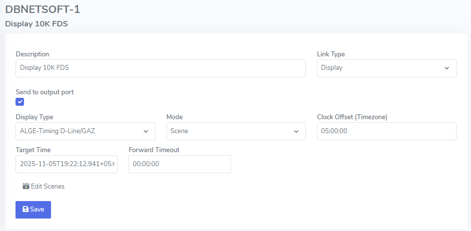

# Release Notes

## 2024-06-17

* Reduced padding on form elements to allow more space to be visible
*   Scenes can be configured in addition to the standard modes

    * Each scene holds it's own script and reference time

    <figure><figcaption></figcaption></figure>
* More internal logging
* Batch link operations
  * Multiple links can be started together
  *   Multiple links can be changed mode together\

      <figure><figcaption></figcaption></figure>

## 2024-06-07

*   Live view&#x20;

    * Reference time can be easily copied and pasted via buttons for efficiency
    * A bigger live preview of what is sent out on output port is visible next to script

    <figure><figcaption></figcaption></figure>

